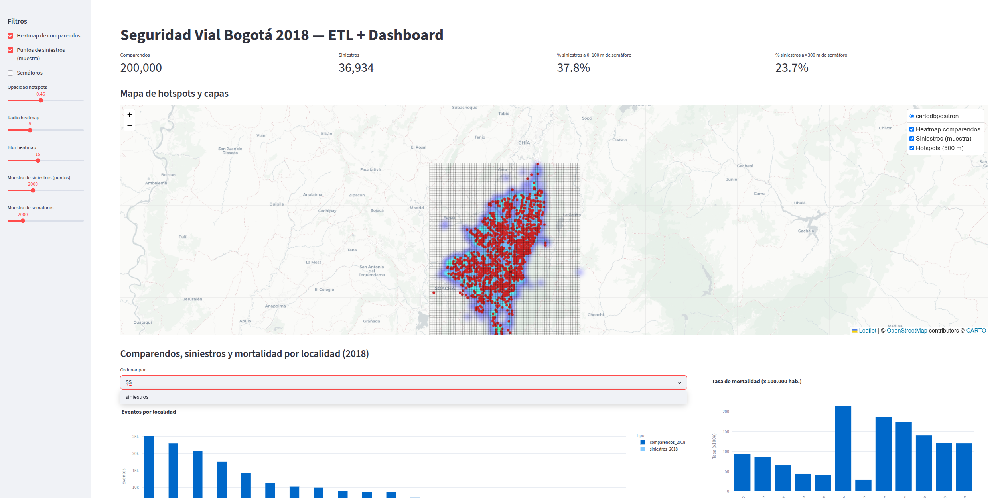
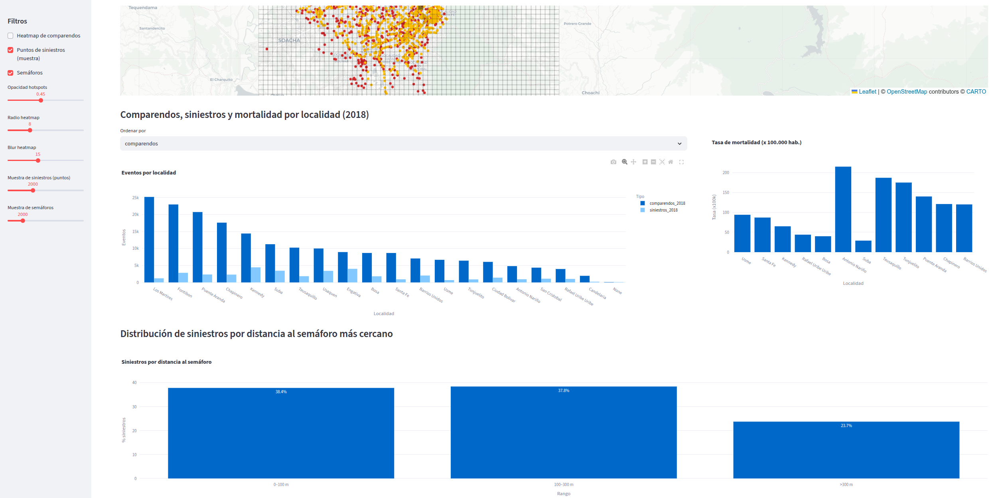
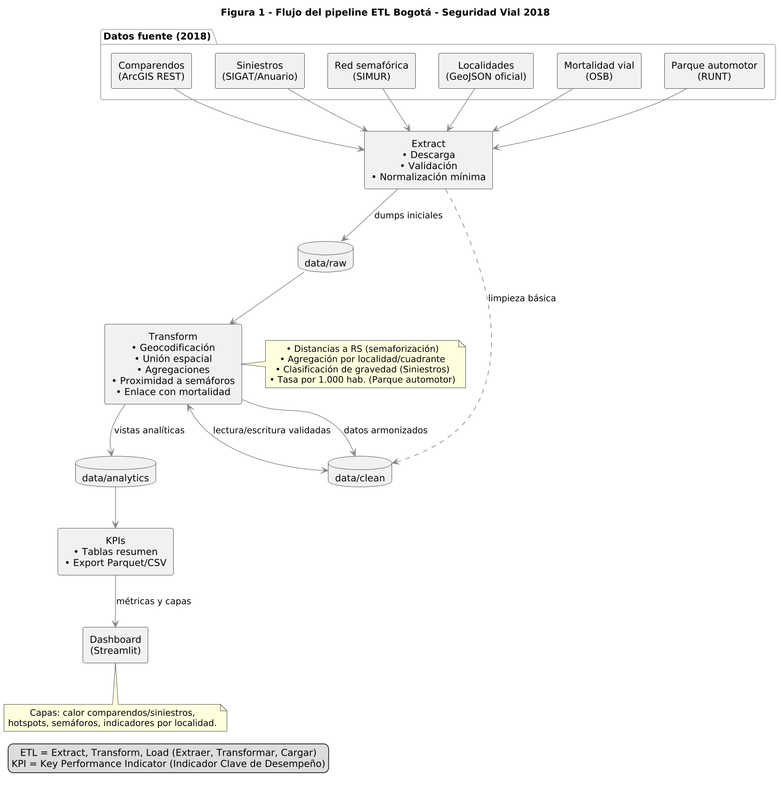

# ETL Bogotá – Seguridad Vial 2018

Proyecto académico de **ETL y analítica urbana** para integrar múltiples fuentes de datos de movilidad en Bogotá:

- Comparendos 2018 (ArcGIS REST)
- Siniestros viales 2018 (Anuario SIGAT)
- Red semafórica (SIMUR)
- Mortalidad vial por localidad (OSB)
- Localidades (GeoJSON oficial)
- Datos del parque automotor (RUNT)

El pipeline extrae, transforma y consolida estos datos en un repositorio analítico, genera indicadores clave (KPIs) y visualiza los resultados en un dashboard interactivo con Streamlit.

---
## Integrantes

- **Jorge Andres Jaramillo Neme**  
- **Luis Fernando Meza**

---

## Instalación y ejecución

### 1) Requisitos

**Linux / macOS**
- Python 3.11+
- `git`
- `make`
- `poetry` (gestión de dependencias y entorno)

**Windows**
- Python 3.11+ (agregar “python” y “pip” al PATH)
- `git`
- Opcional para `make`:
  - Usar Git Bash con `make` (instalar vía paquete `make` de MSYS2/Chocolatey)  
  - **o** ejecutar los comandos equivalentes con `poetry run ...` (ver más abajo)

> Instalación de Poetry (una sola vez)
```bash
# Opción recomendada (si tienes pipx):
pipx install poetry

# Alternativa con pip (usuario actual):
python -m pip install --user poetry
```

### 2) Clonar el repositorio
```bash
git clone https://github.com/jandresjn/etl_2025_final_project
cd etl-bogota-seguridad-vial
```

### 3) (Opcional) Crear venv manual
> Si prefieres que Poetry administre el entorno automáticamente, puedes **omitir** este paso.

**Linux / macOS**
```bash
python -m venv .venv
source .venv/bin/activate
```

**Windows (PowerShell)**
```powershell
python -m venv .venv
.\.venv\Scripts\Activate.ps1
```

### 4) Instalar dependencias con Poetry
```bash
poetry install
```

*(Opcional) activar el shell de Poetry*
```bash
poetry shell
```

### 5) Ejecutar el pipeline completo
```bash
# Con make
poetry run make all

# Si no tienes make (equivalente sugerido)
# poetry run python -m src.extract.all && # poetry run python -m src.transform.all && # poetry run python -m src.analytics.all
```

**Fases que se ejecutan con `make all`:**
- **Extract:** descarga y limpieza de fuentes de datos
- **Transform:** geocodificación, unión espacial, agregaciones, proximidad a semáforos y mortalidad
- **Analytics:** generación de indicadores globales y por localidad

### 6) Ejecutar el dashboard
```bash
poetry run make dashboard
# o, sin make:
#  poetry run python -m src.dashboard.app
```

El dashboard queda disponible en `http://localhost:8501` con:
- Mapa de calor de comparendos y siniestros
- Capas superpuestas con semáforos y hotspots
- Indicadores por localidad y tasa de mortalidad



----
##  Interacción con el Dashboard (Streamlit)

La aplicación permite explorar de forma interactiva los datos de seguridad vial de Bogotá (2018) mediante filtros, controles y visualizaciones dinámicas.

###  Controles principales

- **Heatmap de comparendos:** muestra la concentración de infracciones en el mapa usando un gradiente de color.  
- **Puntos de siniestros:** despliega una muestra aleatoria de siniestros como puntos rojos sobre el mapa.  
- **Semáforos:** visualiza una muestra de la red semafórica como puntos amarillos.  
- **Opacidad de hotspots:** ajusta la transparencia de la capa de zonas críticas (hotspots).  
- **Radio del heatmap:** controla el área de influencia de cada punto en el mapa de calor.  
- **Difuminado del heatmap (blur):** define la suavidad de los bordes del mapa de calor.  
- **Muestra de siniestros:** permite reducir la cantidad de puntos para mejorar el rendimiento.  
- **Muestra de semáforos:** selecciona cuántos puntos de la red semafórica se mostrarán.

###  Visualizaciones disponibles

- **Mapa interactivo:** combina capas de calor, puntos de siniestros y semáforos para análisis espacial.  
- **Gráficas por localidad:** compara el número de comparendos, siniestros y tasas de mortalidad entre localidades.  
- **Distribución por distancia a semáforos:** analiza el porcentaje de siniestros según su proximidad a un semáforo.  

###  Funcionamiento

Cada cambio en los filtros o sliders actualiza el dashboard automáticamente, facilitando el análisis exploratorio y comparativo sin necesidad de recargar la aplicación.

----


## Objetivo general

Desarrollar un flujo ETL reproducible que permita analizar la relación entre comparendos, siniestralidad, red semafórica y mortalidad vial en Bogotá durante 2018, con énfasis en la identificación de zonas críticas (*hotspots*).

---

## Preguntas de investigación

1. ¿Dónde están los *hotspots* (zonas críticas) de comparendos en 2018?  
2. ¿Dónde se concentran los siniestros viales en 2018?  
3. ¿Existen zonas donde coinciden comparendos y siniestros?  
4. ¿Qué tan cerca de los semáforos ocurren los accidentes?  
5. ¿Qué localidades presentan mayor mortalidad vial y cómo se relacionan con los siniestros y comparendos?  
6. ¿Cómo se relaciona la mortalidad con el crecimiento del parque automotor?

---

## Principales hallazgos

- Las zonas de mayor densidad de eventos se concentran en corredores arteriales de **Kennedy, Engativá, Barrios Unidos y Chapinero**.  
- La correlación espacial entre comparendos y siniestros es **moderada (r = 0.27)**, lo que indica que los controles no siempre coinciden con las zonas de mayor riesgo.  
- Más del **37 % de los siniestros** ocurre a menos de 100 metros de un semáforo, sugiriendo concentración de accidentes en intersecciones y cruces.  
- La mortalidad vial se asocia más con la cantidad y gravedad de siniestros que con los comparendos.  
- No se encontró correlación clara entre el crecimiento del parque automotor y la mortalidad, por lo que la tasa de motorización se usa como indicador contextual.  

> En conjunto, el análisis evidencia que las zonas de riesgo no se explican únicamente por la cantidad de vehículos o comparendos, sino por la combinación de densidad vial, diseño urbano y condiciones de interacción entre modos de transporte.

---

## Análisis general de la data

Los datos integran información heterogénea con diferentes niveles de granularidad espacial y temporal.  
Se aplicaron transformaciones para armonizar las fuentes, corregir errores de geocodificación y generar vistas consolidadas por localidad y cuadrante:

- **Comparendos:** filtrados por año, tipo y ubicación; normalizados por cuadrante.  
- **Siniestros:** clasificados por gravedad y tipo de actor (peatón, ciclista, motociclista, etc.).  
- **Red semafórica:** referencia espacial para distancias a puntos de siniestro.  
- **Mortalidad vial:** unida por localidad y año.  
- **Parque automotor:** estandarizado por 1.000 hab. para tasas comparativas.  

**Figura 1.** Flujo general del pipeline ETL y relaciones entre capas.  
*(Colocar la imagen en `assets/figura_1_pipeline.png` y citarla así:)*  




---

## Estructura del proyecto

```
etl-bogota-seguridad-vial/
├─ README.md
├─ pyproject.toml
├─ makefile
├─ data/
│  ├─ raw/
│  ├─ clean/
│  ├─ analytics/
│  └─ working/
├─ src/
│  ├─ extract/
│  ├─ transform/
│  ├─ analytics/
│  └─ dashboard/
└─ notebooks/
```

---


## Licencia y uso

Este proyecto es de carácter **académico** y utiliza únicamente fuentes de **datos abiertos** de la Alcaldía Mayor de Bogotá y el Observatorio de Movilidad.  
Los resultados son informativos y **no constituyen análisis oficial** de seguridad vial.